Student Performance Analyzer

About
This is a simple JavaScript console program where I worked with student data and tried to analyze it in different ways.
The idea was to take marks of students and calculate things like totals, averages, subject-wise performance and grades.

Everything runs in the console only.

Output Screenshots

1. Total Marks
This functions calculates the total marks for each student.I calculated it by using a for loop
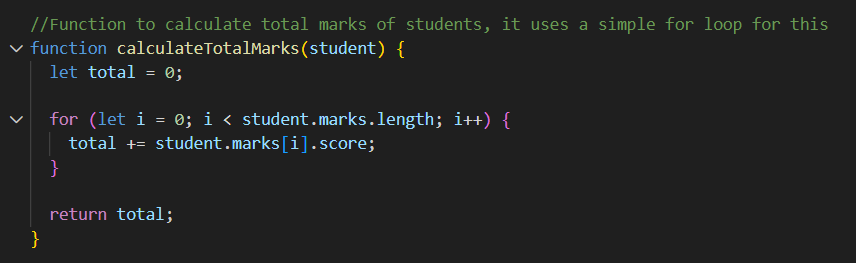
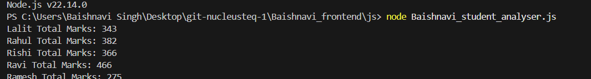

2. Student's Average Marks
Average is calculated using total marks divided by number of subjects.
I reused the total marks function here instead of writing logic again.
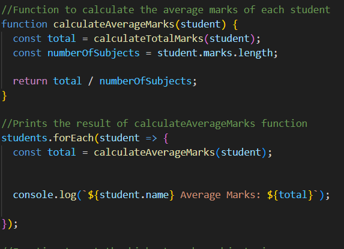
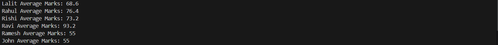

3. Subject-wise Highest
This shows who scored the highest in each subject.
I compared marks across all students and updated the highest value whenever needed.
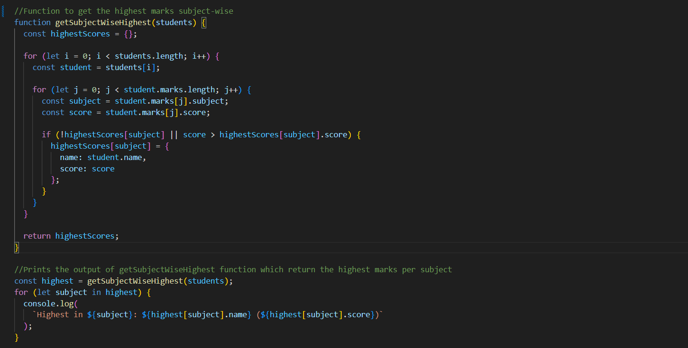
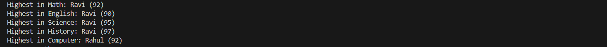

4. Subject-wise Average
For each subject, I stored total marks and how many entries are there.
Then I calculated the average using total/count.
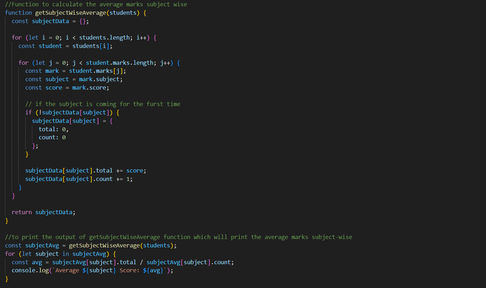
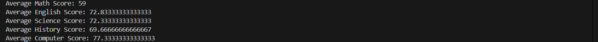

5. Class Topper
The student with the highest total marks is printed here.
I looped through all students and tracked the maximum.
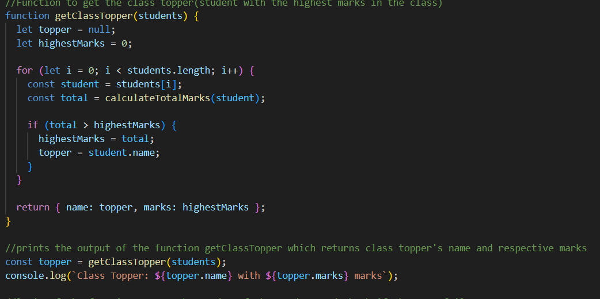
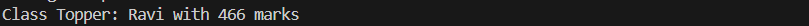

6. Grades
Grades are assigned based on average marks.
Before that, I checked fail conditions like low marks in any subject or low attendance.
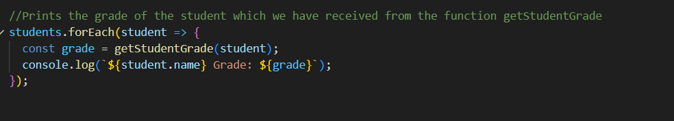
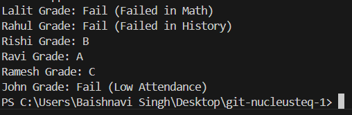

How to Run

• Open the file in browser console or Node

• Run the script

• Output will be visible in console/terminal