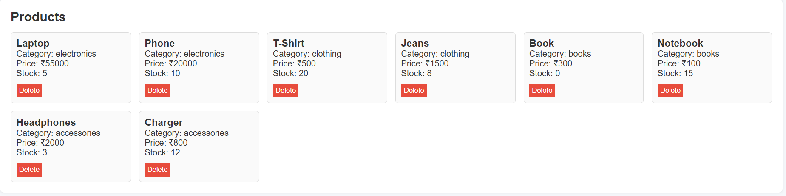
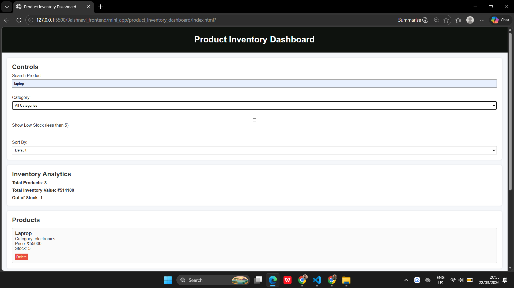
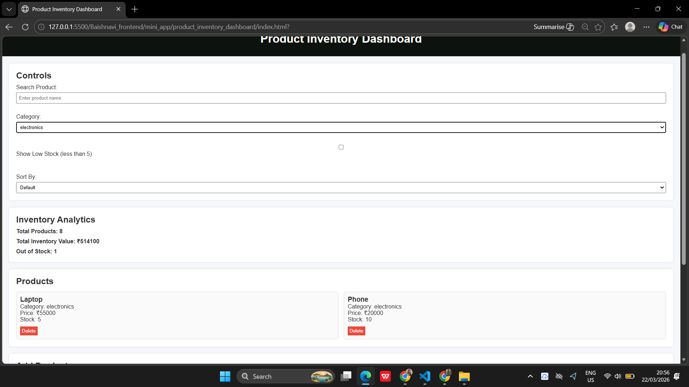
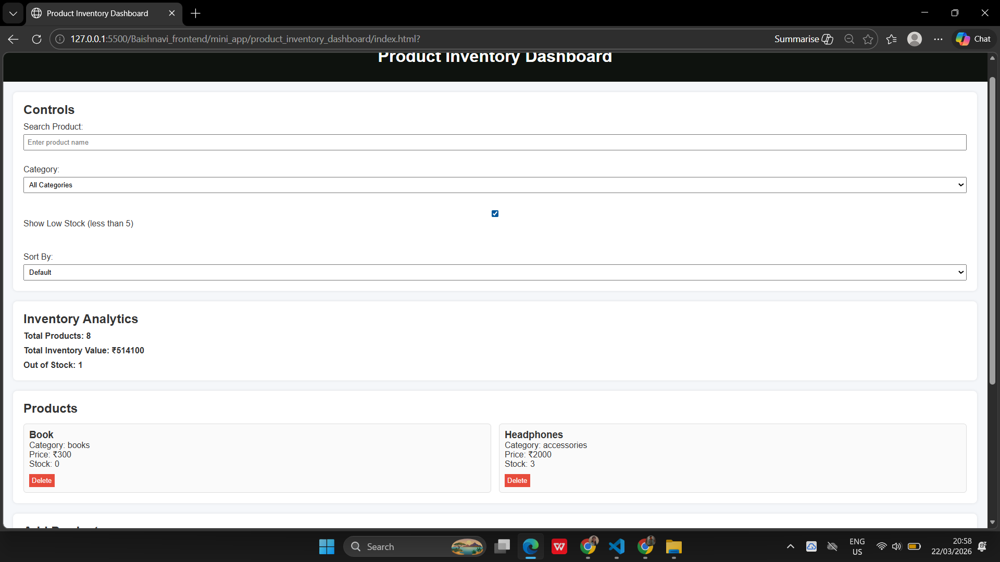
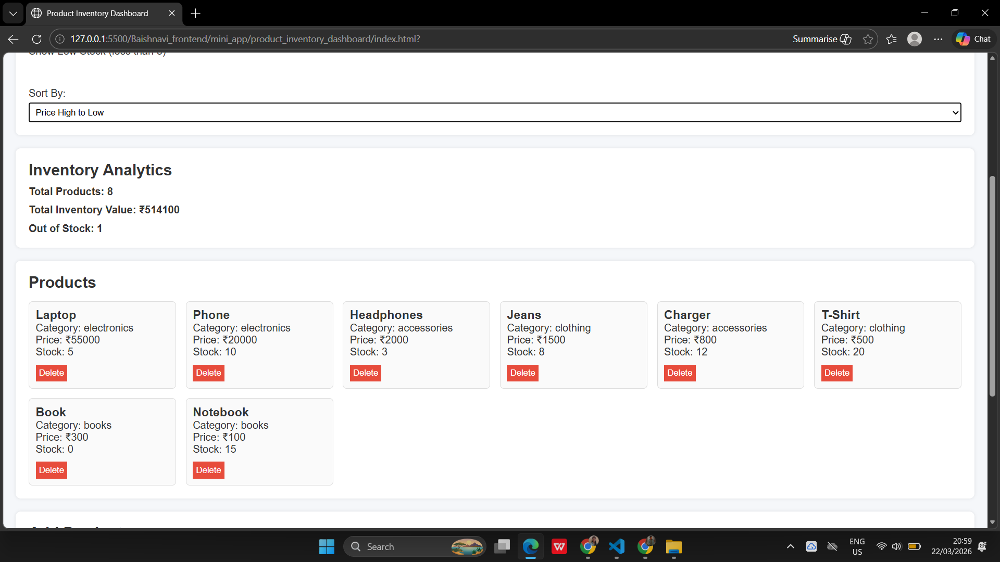
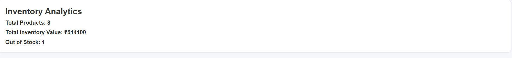
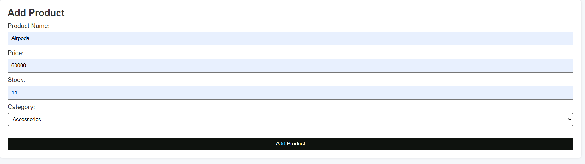
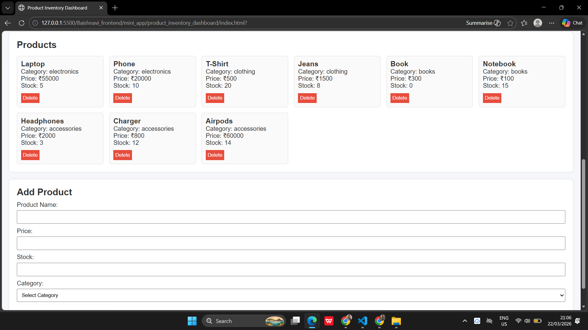
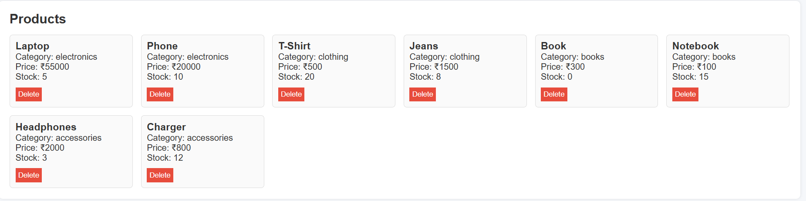
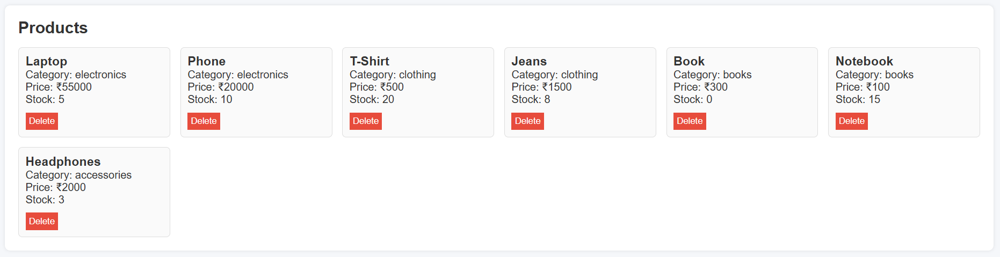

# Product Inventory Dashboard

## Overview

This is a simple web-based project where I built a Product Inventory Dashboard using HTML, CSS and JavaScript.

The main idea was to manage products dynamically and perform different operations like searching, filtering, sorting and analyzing product data.

I also implemented localStorage so that data does not get lost after refreshing the page.

Everything runs in the browser.

---

## Features

* Dynamic product display using JavaScript
* Real-time search functionality
* Category-based filtering
* Low stock filter (stock < 5)
* Sorting (price and alphabetical)
* Add new product with validation
* Delete product
* Inventory analytics (total, value, out of stock)
* Data persistence using localStorage
* Loading simulation using Promise and setTimeout

---

## Output Screenshots

### 1. Display Products

This shows all the products in a structured format on the screen.
Products are rendered dynamically using JavaScript instead of hardcoding HTML.

---

### 2. Search Functionality

This allows searching products by name.
It works in real-time and is case-insensitive.

---

### 3. Category Filter

Products can be filtered based on category using a dropdown.
I populated the dropdown dynamically from product data.

---

### 4. Low Stock Filter

This shows only products with stock less than 5.
I used a checkbox to toggle this condition.

---

### 5. Sorting

Products can be sorted based on:

* Price (Low to High / High to Low)
* Alphabetically (A-Z / Z-A)

Sorting is applied after filtering.

---

### 6. Inventory Analytics

This section shows:

* Total number of products
* Total inventory value
* Number of out-of-stock products

I calculated these values using loops.

---

### 7. Add Product

This allows adding new products using a form.
I also added validation to prevent invalid inputs.

Newly added products are immediately on the UI

---

### 8. Delete Product

Each product has a delete button.

On clicking it, the product is removed from both UI and data.

---

### 9. Data Persistence (localStorage)

All data is saved in localStorage.
So even after refreshing the page, products remain the same.

---

### 10. Loading Simulation

I used Promise and setTimeout to simulate loading like an API call.
A loading message is shown before products appear.

---

## How to Run

### Prerequisites

* A web browser (Chrome, Edge, etc.)

### Steps

• Open the project folder
• Open index.html in browser
• Wait for products to load

### Usage

You can:

* Search products
* Apply filters
* Sort products
* Add new products
* Delete products

Data will be stored automatically in localStorage.

---